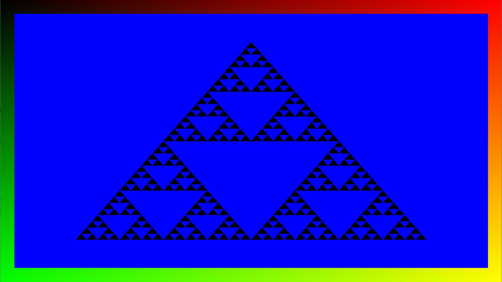
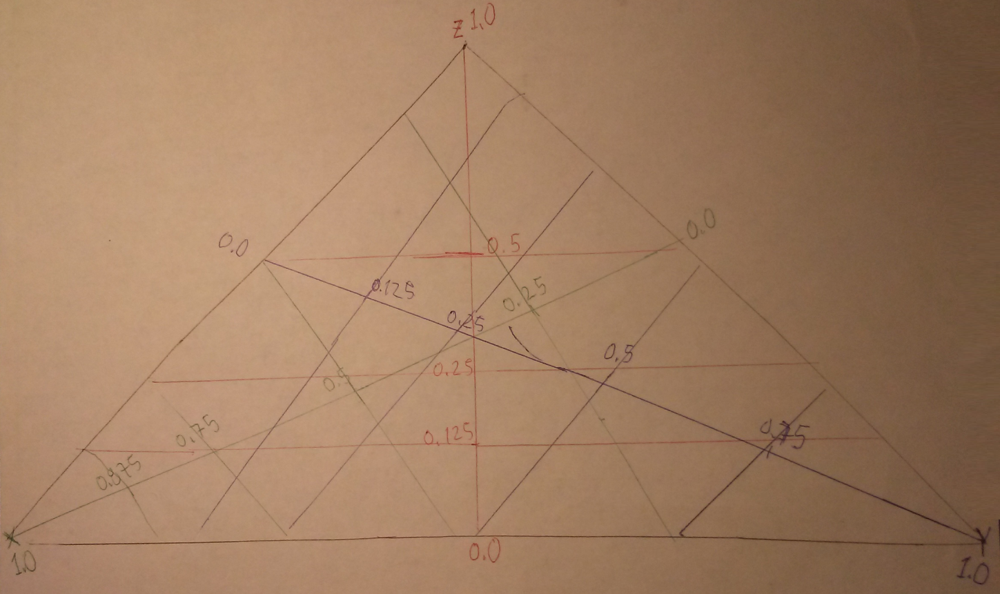

# D3D12 Raytracing Sierpinski Triangle Shader

### By Konstantin Rebrov



##### Introduction
This is a graphics program which uses D3D12 Raytracing in HLSL to draw the Sierpinski Triangle Pattern. This program is based on [Microsoft's D3D12 Raytracing Examples](https://github.com/microsoft/DirectX-Graphics-Samples). I modified the HLSL code to generate the Sierpinski Triangle Pattern within the window. I didn't change the C++ Driver code which creates the window.

##### Overview
My HLSL code sample, inside the file `Raytracing.hlsl` implements three shaders: *ray generation*, *closest hit* and *miss* shader. The ray generation shader is executed for the whole render target via DispatchRays(). If a ray index corresponding to a pixel is inside a stencil window, it casts a ray into the scene. For ray indices outside the stencil window, the shader outputs color based on the ray's xy dispatch coordinates from top-left. Casted rays that hit the triangle use barycentric coordinates to determine the ray's hit position within the pattern, whether to shade it or not. Missed rays trigger the miss shader, which draws the blue background.

##### Details
The algorithm that draws the Sierpinski Triangle Pattern I created by myself. It is my own original algorithm.

The Sierpinski Triangle Pattern is recursive. A blue inverted triangle is drawn in the middle of the black triangle, creating three separate black triangles around the sides. These are the top triangle, left triangle, and right triangle. For each one of these triangles we once again draw a blue inverted trinagle in the middle, subdividing each one of these black triangles into three even smaler black triangles. The hit shader in my HLSL code calls a recursive function `draw_triangle()` providing the barycentric coordinates of the given pixel where the ray hit, the range inside which the blue triangle is drawn, and an increment value. Since HLSL shaders do not have recursion, I have to create multiple function definitions, one for each stack frame. The initial range value `float3(0.5, 0.5, 0.5)` draws the first big inverted blue triangle in the middle of the black triangle. Then each successive pseudo-recursive function call adjusts the range for the top triangle, left triangle, and bottom triangle, relative to the current triangle. And it draws a smaller blue inverted triangle in the center of each. the increment represents the size of the triangles, and it is divided by two for each successive pseudo-recursive level.

```
float draw_triangle(in MyAttributes attr, in float3 range, in float increment) {

    float blue = 0.0;

    // Get the color of the center triangle.
    if (attr.barycentrics.x < range.x &&
        attr.barycentrics.y < range.y &&
        (1 - attr.barycentrics.x - attr.barycentrics.y) < range.z)
        blue += 1.0;
    
    // Get the color of the top triangle.
    blue += draw_triangle2(attr, float3(range.x - increment, range.y - increment, range.z + increment), increment / 2);
    // Get the color of the left triangle.
    blue += draw_triangle2(attr, float3(range.x + increment, range.y - increment, range.z - increment), increment / 2);
    // Get the color of the right triangle.
    blue += draw_triangle2(attr, float3(range.x - increment, range.y + increment, range.z - increment), increment / 2);

    return blue;
}
```



## Usage
D3D12RaytracingSierpinskiTriangle.exe 

Additional arguments:
  * [-forceAdapter \<ID>] - create a D3D12 device on an adapter \<ID>. Defaults to adapter 0.

### UI
The title bar of the sample provides runtime information:
* Name of the sample
* Frames per second
* Million Primary Rays/s: a number of dispatched rays per second calculated based of FPS.
* GPU[ID]: name

## Requirements
* Windows 10 with the October 2018 update or higher.
* [Visual Studio 2019](https://www.visualstudio.com/).
* [Windows 10 May 2019 (18362) SDK](https://developer.microsoft.com/en-US/windows/downloads/windows-10-sdk).
  * Windows 10 with the May 2019 update. 
  * Dx12 GPU with a compatible DirectX Raytracing driver.
    * Nvidia: driver version 415 or higher.
    * Other vendors - please consult the vendor you’re working with for HW and driver availability.
